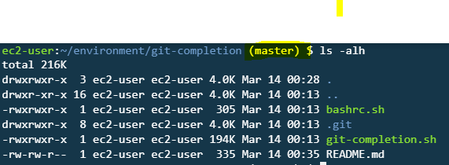

# git-completion
Repository to have git completion and autobranch detection

- Execute the bashrc.sh shell script which will add the complettion experession in bashrc
- copy the git-completion.bash file into /etc/bash_completion.d/ to launch the git-completion at the start of bash

    > cp git-completion.sh /etc/bash_completion.d/

